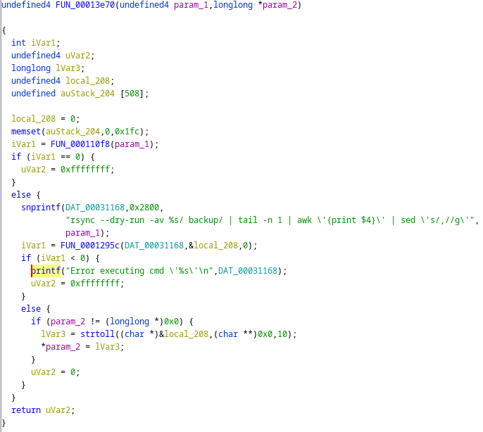

# Amlogic eMMC Partition Tool / Amlogic eMMC分区工具
**ampart** is a partition tool initially written for **[HybridELEC]** (my project that brings side-by-side dual-booting support on the same drive to **[CoreELEC]**+**[EmuELEC])** to replace the closed-source script ceemmc for easy re-partitioning of internal eMMC device for **almost all Amlogic devices** to liberate me from editing the device tree for every device just to achive a custom partition layout, in an attempt to achieve **Android+CE+EE triple boot on eMMC**.   
**ampart**是我最初为了在 **[HybridELEC]**（我的实现了 **[CoreELEC]**+**[EmuELEC]** 同驱动器双系统启动的项目）里替换闭源的脚本ceemmc写的分区工具，为了简单地编辑**几乎所有Amlogic设备**的内置eMMC设备重新分区，从而让我从为了实现**安卓+CE+EE在eMMC上三系统启动**的而无尽地修改每个设备树的重复劳动里解放出来

Yet now it has become **the one and only partition tool** for Amlogic's proprietary eMMC partition table format. It is written totally in **C** for portability and therefore **simple, fast yet reliable**, and provides a simple yet powerful argument-driven CLI for easy implementation in scripts  
不过目前ampart已经成为了**那个唯一的**能用在Amlogic的专有eMMC分区表格式上的分区工具。ampart为了便于移植，完全是用**C**写的，也因此**简单，快速且可靠**，并提供了一个在脚本里调用非常简单却强大的通过参数驱动的命令行界面

The following SoCs are proven to be compatible with ampart:  
下列SoC已证明与ampart相兼容
 - gxbb (s905)
 - gxl (s905l, s905x, s905d)
 - g12a (s905x2)
 - g12b (s922x)
 - sm1 (s905x3)
 - sc2 (s905x4) 


*DTB modes ``dclone`` and ``dedit`` is more recommended for post-sc2 SoCs, as they will break if the partitions node in DTB is broken  
对于sc2后的SoC来说，更推荐`dclone`和`dedit`模式，因为如果DTB里的分区节点故障的话，它们可能会砖*  


It supports building and running under following platforms:  
ampart支持在以下平台上构建和运行：
 - x86_64
   - mainly on dumped images  
     主要是在dump的镜像上
 - aarch64
   - either on eMMC directly, or   
     可以直接在eMMC上操作
   - on dumped image  
     也可以在dump的镜像上

*Please note for ARM only strict aarch64 host is correctly supported, a partial aarch64 system (e.g. [LibreELEC] and [CoreELEC] with 64-bit kernel and 32-bit userspace) could be incompatible due to some >=64 bit data types being used, as a workaround you can run the aarch64 static build on a full aarch64 system (e.g. [ArchLinuxARM], [EmuELEC], [Armbian], [OpenWrt], etc.) to install it. A good news is [CoreELEC] is ppossibly switching to full aarch64 for their newer builds, but I don't know when that will come, probably [soon™]  
请注意，对于ARM，只有严格的aarch64宿主是支持的，一个不完整的aarch64系统（比如说[LibreELEC]和[CoreELEC]，内核是64位而用户空间是32位的），由于一些64位以上的数据类型，可能会造成不兼容问题。要绕过这个问题，你可以在一个完整的aarch64系统上（比如[ArchLinuxARM]，[EmuELEC]，[Armbian]，[OpenWrt]等）上安装。好消息是CoreELEC可能会在更新的构建里切换到完全的aarch64，不过我不知道具体是什么时候来，只能说[soon™]*

*Please note **ampart is a partition tool and only a partition tool**, it could be used in installation but it's out of its support scope here, please refer to your corresponding distro for help if it uses ampart for installation (e.g. [EmuELEC] and [Armbian]). The script `aminstall.py` under [scripts] is just for **demo usage** as other official demo scripts.  
也请注意**ampart只是一个分区工具**，确实它可以用来安装，但具体的安装问题这里不支持，如果你的发行版使用ampart安装（比如，[EmuELEC]和[Armbian]），请到你对应的发行版寻求支持。[scripts]下面的``aminstall.py``和其他官方演示脚本一样，只是用作**演示用途***
 

# Usage / 用途
With ampart, you can safely turn an eMMC partition table (EPT) that co-exists with MBR/GPT partition tables on Amlogic devices from like this where you dare not create MBR/GPT partitions on:  
通过ampart，你可以简单地把Amlogic设备上可以和MBR/GPT分区表并存的一个eMMC分区表（EPT）从这种你不敢创建MBR/GPT分区表的样子：
```
===================================================================================
ID| name            |          offset|(   human)|            size|(   human)| masks
-----------------------------------------------------------------------------------
 0: bootloader                      0 (   0.00B)           400000 (   4.00M)      0
    (GAP)                                                 2000000 (  32.00M)
 1: reserved                  2400000 (  36.00M)          4000000 (  64.00M)      0
    (GAP)                                                  800000 (   8.00M)
 2: cache                     6c00000 ( 108.00M)                0 (   0.00B)      0
    (GAP)                                                  800000 (   8.00M)
 3: env                       7400000 ( 116.00M)           800000 (   8.00M)      0
    (GAP)                                                  800000 (   8.00M)
 4: frp                       8400000 ( 132.00M)           200000 (   2.00M)      1
    (GAP)                                                  800000 (   8.00M)
 5: factory                   8e00000 ( 142.00M)           800000 (   8.00M)     17
    (GAP)                                                  800000 (   8.00M)
 6: vendor_boot_a             9e00000 ( 158.00M)          1800000 (  24.00M)      1
    (GAP)                                                  800000 (   8.00M)
 7: vendor_boot_b             be00000 ( 190.00M)          1800000 (  24.00M)      1
    (GAP)                                                  800000 (   8.00M)
 8: tee                       de00000 ( 222.00M)          2000000 (  32.00M)      1
    (GAP)                                                  800000 (   8.00M)
 9: logo                     10600000 ( 262.00M)           800000 (   8.00M)      1
    (GAP)                                                  800000 (   8.00M)
10: misc                     11600000 ( 278.00M)           200000 (   2.00M)      1
    (GAP)                                                  800000 (   8.00M)
11: dtbo_a                   12000000 ( 288.00M)           200000 (   2.00M)      1
    (GAP)                                                  800000 (   8.00M)
12: dtbo_b                   12a00000 ( 298.00M)           200000 (   2.00M)      1
    (GAP)                                                  800000 (   8.00M)
13: cri_data                 13400000 ( 308.00M)           800000 (   8.00M)      2
    (GAP)                                                  800000 (   8.00M)
14: param                    14400000 ( 324.00M)          1000000 (  16.00M)      2
    (GAP)                                                  800000 (   8.00M)
15: odm_ext_a                15c00000 ( 348.00M)          1000000 (  16.00M)      1
    (GAP)                                                  800000 (   8.00M)
16: odm_ext_b                17400000 ( 372.00M)          1000000 (  16.00M)      1
    (GAP)                                                  800000 (   8.00M)
17: oem_a                    18c00000 ( 396.00M)          2000000 (  32.00M)      1
    (GAP)                                                  800000 (   8.00M)
18: oem_b                    1b400000 ( 436.00M)          2000000 (  32.00M)      1
    (GAP)                                                  800000 (   8.00M)
19: boot_a                   1dc00000 ( 476.00M)          4000000 (  64.00M)      1
    (GAP)                                                  800000 (   8.00M)
20: boot_b                   22400000 ( 548.00M)          4000000 (  64.00M)      1
    (GAP)                                                  800000 (   8.00M)
21: rsv                      26c00000 ( 620.00M)          1000000 (  16.00M)      1
    (GAP)                                                  800000 (   8.00M)
22: metadata                 28400000 ( 644.00M)          1000000 (  16.00M)      1
    (GAP)                                                  800000 (   8.00M)
23: vbmeta_a                 29c00000 ( 668.00M)           200000 (   2.00M)      1
    (GAP)                                                  800000 (   8.00M)
24: vbmeta_b                 2a600000 ( 678.00M)           200000 (   2.00M)      1
    (GAP)                                                  800000 (   8.00M)
25: vbmeta_system_a          2b000000 ( 688.00M)           200000 (   2.00M)      1
    (GAP)                                                  800000 (   8.00M)
26: vbmeta_system_b          2ba00000 ( 698.00M)           200000 (   2.00M)      1
    (GAP)                                                  800000 (   8.00M)
27: super                    2c400000 ( 708.00M)         90000000 (   2.25G)      1
    (GAP)                                                  800000 (   8.00M)
28: userdata                 bcc00000 (   2.95G)        68b000000 (  26.17G)      4
===================================================================================
```
with an easy command  
通过一条简单地命令
```
ampart /path/to/your/eMMC/drive/or/dumped/image --mode dclone data::-1:4
```
to like this where you can freely create MBR/GPT partitions on (4M-36M, 100M-116M, 117M-end):  
转换成这样你可以自由创建MBR/GPT分区表的样子（4M-36M，100M-116M，117M到结尾）
```
===================================================================================
ID| name            |          offset|(   human)|            size|(   human)| masks
-----------------------------------------------------------------------------------
 0: bootloader                      0 (   0.00B)           400000 (   4.00M)      0
    (GAP)                                                 2000000 (  32.00M)
 1: reserved                  2400000 (  36.00M)          4000000 (  64.00M)      0
    (GAP)                                                  800000 (   8.00M)
 2: cache                     6c00000 ( 108.00M)                0 (   0.00B)      0
    (GAP)                                                  800000 (   8.00M)
 3: env                       7400000 ( 116.00M)           800000 (   8.00M)      0
    (GAP)                                                  800000 (   8.00M)
 4: data                      8400000 ( 132.00M)        73f800000 (  28.99G)      4
===================================================================================
```
without breaking the partitions node in DTB so post-SC2 devices won't brick after partitioning (since they rely on partitions node in DTB to work)  
而不破坏DTB里面的分区节点，所以SC2之后的设备不会在分区后变砖（因为它们依赖DTB里的分区节点来正常工作）

And if you're willing to break partitions node in DTB, (should be OK for everything before SC2), then with a command line like this:  
如果你愿意破坏DTB里面的分区节点的话，（对于SC2之前的来说应该都没问题），那么像这样的一条命令
```
ampart /path/to/your/eMMC/drive/or/dumped/image --mode ecreate data:::
```
you can turn EPT further to like this where you can freely create MBR partitions on more areas(5M-36M, 100M-end):  
就能把EPT进一步转变成像这样可以在更多区域创建MBR分区（5M-36M，100M到结尾）
```
===================================================================================
ID| name            |          offset|(   human)|            size|(   human)| masks
-----------------------------------------------------------------------------------
 0: bootloader                      0 (   0.00B)           400000 (   4.00M)      0
 1: env                        400000 (   4.00M)           800000 (   8.00M)      0
 2: cache                      c00000 (  12.00M)                0 (   0.00B)      0
    (GAP)                                                 1800000 (  24.00M)
 3: reserved                  2400000 (  36.00M)          4000000 (  64.00M)      0
 4: data                      6400000 ( 100.00M)        741800000 (  29.02G)      4
===================================================================================
```

There're many more different modes available in ampart, please refer to the documentation for their corresponding usages.  
ampart里有许多不同的模式，请参考文档来了解它们各自的用途

# Documentation / 文档
Please refer to the documentation under [doc] for the usage and details about the arguments and official demo scripts. The ampart program itself **does not have built-in CLI help message**, as it is intended to be used by power users or in scripts, for which the officially maintained doc in the repo should always be refered to anyway.  
请参考[doc]下的文档来了解参数的细节和用法，以及官方演示脚本。ampart程序本身**不提供内置的CLI帮助信息**，因为它应该被高级用户或者是在脚本里使用，而对于这些用途应该始终参照官方维护的文档


# Building / 构建
If you're using an ArchLinux-derived distro (ArchLinux itself, ArchLinux ARM, Manjaro, etc), you can build ampart with the AUR package [ampart-git] maintained by myself:  
如果你用的是ArchLinux衍生的发行版（ArchLinux自己，ArchLinuxARM，Manjaro等），你可以通过我自己维护的AUR包[ampart-git]来构建ampart：
```
git clone https://aur.archlinux.org/ampart-git.git
cd ampart-git
makepkg -si
```
Otherwise, you'll have to clone the repo and build it from source with ``make``. If you're using a Debian-derived distro like Ubuntu, for example, you can build it like this (ampart only depends on ``zlib``, the FDT support is implemented from ground up without `libfdt` at all):  
不然的话，你就要克隆仓库然后用`make`从源码构建。如果你用的是Debian衍生的发行版比如说Ubuntu，你可以像这样构建（ampart只依赖`zlib`，设备树的支持是从底层不经`libfdt`实现的）
 - Install the build dependencies, You could ignore these apt commands if you have the build tools and dependencies installed  
 安装构建依赖，如果你已经安装了这些工具，你可以略过这一步
    ```
    sudo apt update
    sudo apt install build-essential zlib1g-dev git
    ```
 - Clone and build  
 克隆并构建
    ```
    git clone https://github.com/7Ji/ampart.git
    cd ampart
    make
    ```

If incorporating into a [LibreELEC]-derived distro, then the following `package.mk` could be used:  
如果要整合入[LibreELEC]衍生发行版中，那么可以用下面这样的`package.mk`
```
# SPDX-License-Identifier: GPL-3.0
# Copyright (C) 2022-present Guoxin "7Ji" Pu (https://github.com/7Ji)

PKG_NAME="ampart"
PKG_ARCH="x86_64 aarch64" 
PKG_VERSION="2898ee3b62705132b81bb442ff904bebed4dab4a"
PKG_SHA256="b543478bedaaf03c4e9eafdfbd8c639245665a2aa3044304af74201336b9b31a"
PKG_LICENSE="GPL3"
PKG_SITE="https://github.com/7Ji/ampart"
PKG_URL="$PKG_SITE/archive/$PKG_VERSION.tar.gz"
PKG_MAINTAINER="7Ji"
PKG_LONGDESC="A simple, fast, yet reliable partition tool for Amlogic's proprietary emmc partition format."
PKG_DEPENDS_TARGET="toolchain zlib u-boot-tools:host"
PKG_TOOLCHAIN="make"
PKG_MAKE_OPTS_TARGET="VERSION_CUSTOM=${PKG_VERSION}"

makeinstall_target() {
  install -Dm755 $PKG_DIR/ampart $INSTALL/usr/sbin/ampart
}
```
# Inclusion in other projects / 包含在其他项目中

You're free to include ampart in your project as long as it meets [the license][license]. The [Makefile] and the above `package.mk` is a good starting point if you're gonna include `ampart` in your project. You're recommended to build it from source rather than downloading the binary release  
你可以自由地把ampart引入到你的项目中，只要它符合[授权许可][license]。[Makefile]和上面的`package.mk`可以当作把`ampart`加入你项目的参考。建议你从源码构建，而不是下载二进制发布
 
But if you're gonna do it, do it in the proper way: handling the ampart's stdout to utilize its CLI **with a script**, shell or Python they're all fine, **don't use another stupid C program and possibly system() to wrap it around**, because **ampart was specially written to provide a stable CLI but not C API**.  
但你要是做的话就用正确的方式去做：用脚本通过ampart的命令行界面处理它的标准输出，shell或者是Python都可以，**别用另一个傻了吧唧的C程序用system()来调用**，因为**ampart是特别提供稳定的命令行界面但不保证稳定的C API**

And let's make it clear, it's stupid enough to use `system()` to use C as script, but I can accept it even I don't use any in my program. **But** the stupidity is out of my understanding **if you're using system() and piping inside it**. The following decompiled function in *the-tool-that-should-not-be-named* just blew my mind: Effectively this is just hiding a script as a black box binary just so users could find your magical binary admirable. **Don't even mention ampart in your project if you're doing so, you will make me shame on your whole team**  
而且咱们整明白了，用`system()`来把C当脚本用已经够蠢了，不过尽管我不会这么做但我还能接受。**但是你要是用`system()`还在里面用管道的话**，愚蠢程度我无法接受。下面这个从*那个C什么E什么名字不能提的项目*里的脚本反编译出来的函数给我整麻了：本质上这就是把个脚本当成他妈的黑盒二进制然后用户觉得你的魔幻的二进制牛逼的三脚猫伎俩。**你要是这么做，别在你的项目里提ampart，我为你们整个团队感到羞耻**

 
 


# License / 授权许可
**ampart**(Amlogic emmc partition tool) is licensed under [**GPL3**](https://gnu.org/licenses/gpl.html)
 * Copyright (C) 2022 7Ji (pugokushin@gmail.com)
 * This program is free software: you can redistribute it and/or modify it under the terms of the GNU General Public License as published by the Free Software Foundation, either version * of the License, or (at your option) any later version.

 * This program is distributed in the hope that it will be useful, but WITHOUT ANY WARRANTY; * without even the implied warranty of MERCHANTABILITY or FITNESS FOR A PARTICULAR PURPOSE. See the GNU General Public License for more details.

 * You should have received a copy of the GNU General Public License along with this program. If not, see <https://www.gnu.org/licenses/>.

[license]: #license--授权许可

[doc]: doc
[scripts]: scripts/aminstall


[ArchLinuxARM]:https://github.com/7Ji/amlogic-s9xxx-archlinuxarm
[Armbian]:https://github.com/ophub/amlogic-s9xxx-armbian
[CoreELEC]:https://github.com/CoreELEC/CoreELEC
[EmuELEC]:https://github.com/EmuELEC/EmuELEC
[HybridELEC]:https://github.com/7Ji/HybridELEC
[LibreELEC]:https://github.com/LibreELEC/LibreELEC.tv
[Makefile]:Makefile
[OpenWrt]:https://github.com/ophub/amlogic-s9xxx-openwrt
[ampart-git]:https://aur.archlinux.org/packages/ampart-git
[soon™]:https://discourse.coreelec.org/t/does-odroid-n2-still-worth/19585/13